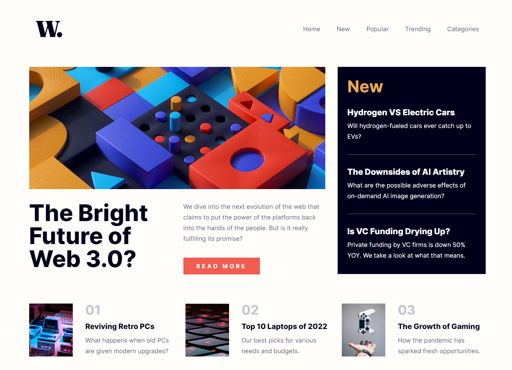
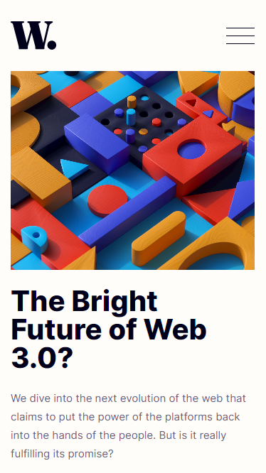

# Media Queries

A CSS exercise done during my training at [BeCode](https://becode.org/all-trainings/pedagogical-framework-junior-developer/).

## The Goal

The project was to create a responsive web page using media queries.  

## What does it look like ?

Check the result ➡️ [here](https://dystrima.github.io/Media-Queries/) ⬅️

